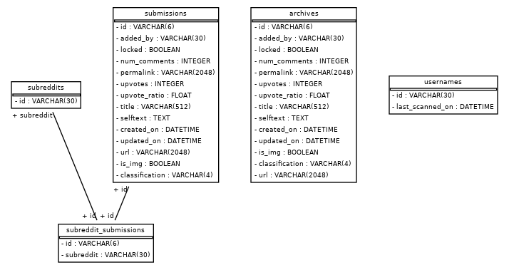

# arg-feedback-loop

## Setup

### Creating the Virtual Environment

So you don't have clashes with your own package manager for your Linux distribution, operate the project
in a virtual environment.

Ensure `virtualenv` is installed for Python 3.

```
$ virtualenv venv # Creates venv/ directory in project
$ source venv/bin/activate
```

### Installing Dependencies

`pip install -r requirements.txt`

## DB



### Starting Database

Default creds: `root:root`
Default database: `argwatch`

`docker-compose up -d db`

## Running Program

`docker-compose up -d db && ./main.py`

## Useful Scripts

* [scripts/postgres-console.sh](scripts/postgres-console.sh) 
	- launch a PSQL instance on the arg-watch database for quick querying
* [scripts/postgres-nuke.sh](scripts/postgres-nuke.sh)
	- In the event of database getting massively fucked, tear down docker container/images/volumes and DROP/recreate
* [scripts/start-db.sh](scripts/start-db.sh)
